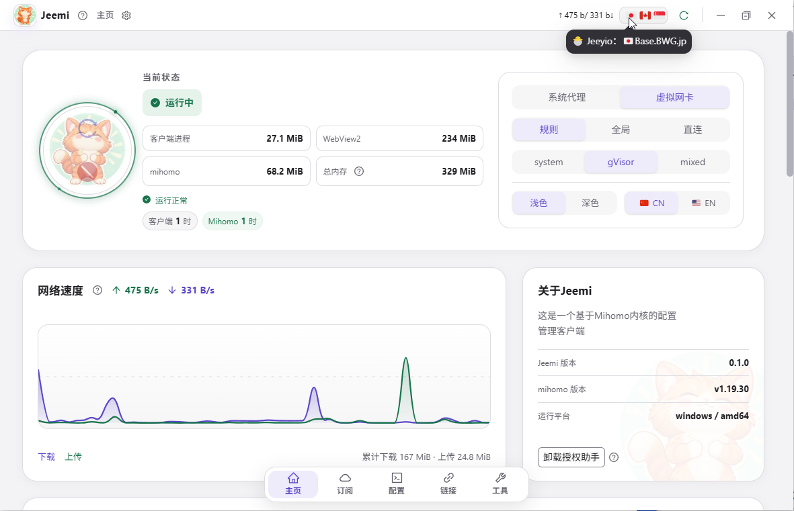
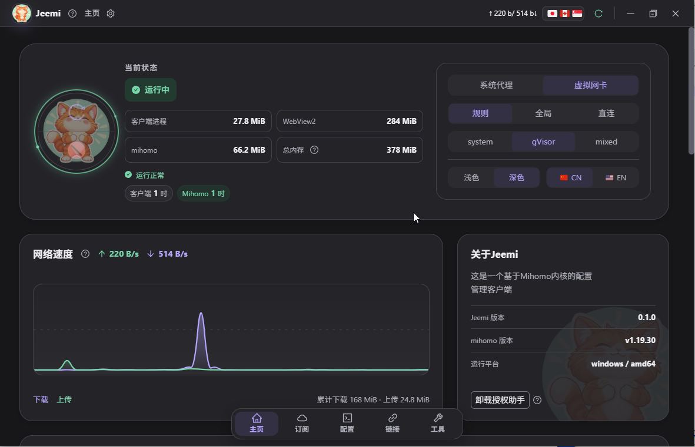
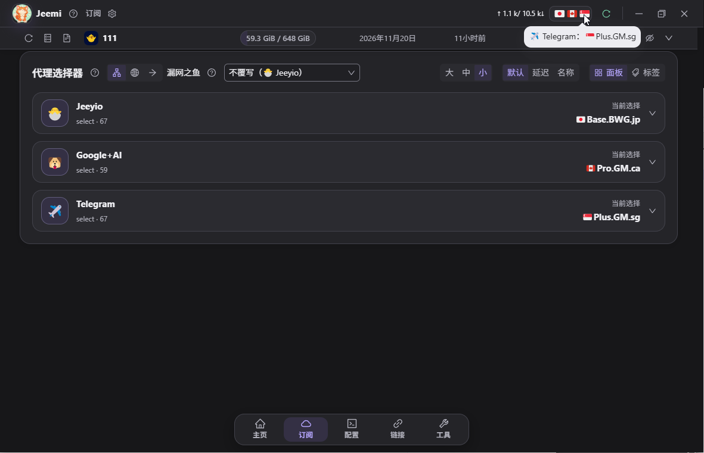
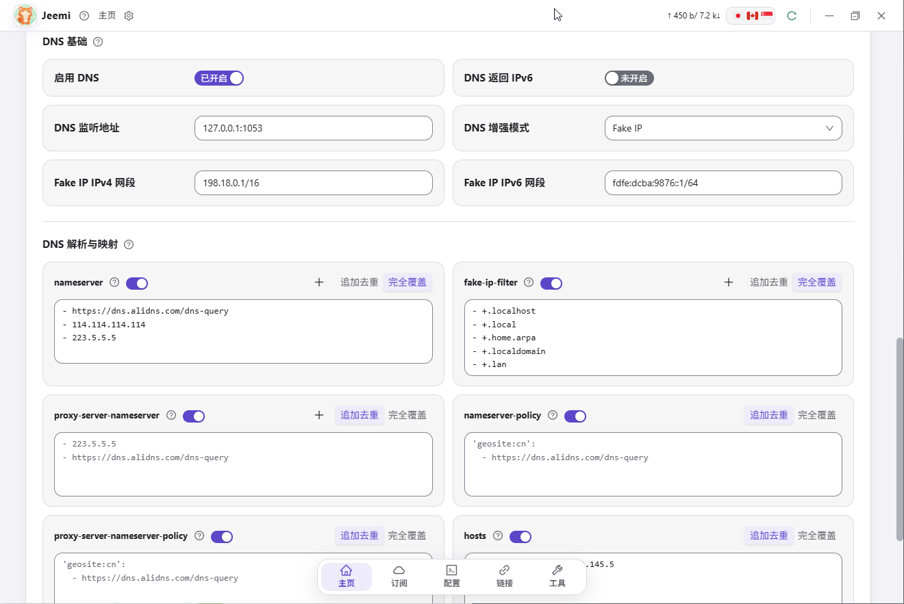

# Jeemi

Jeemi 是面向 Windows、macOS 和 Linux 的桌面代理管理客户端，使用 Wails、Go 和 React 构建，通过独立运行的官方 mihomo 核心提供代理能力。

Jeemi 负责管理订阅、本地配置、脚本、核心版本与系统网络设置。项目不提供代理节点或订阅服务，不修改或内嵌 mihomo 源码；核心由客户端单独下载或导入。

## 主要功能

- 导入和更新订阅，支持 URL、文件和二维码，显示订阅流量及有效期信息。
- 使用可视化本地配置或隔离 JavaScript 脚本重构订阅；每份订阅选择其中一种处理方式。
- 管理可复用的本地策略组、选择器和规则集，支持排序、启用开关、节点名称与协议筛选。
- 本地配置和脚本支持 JSON 导入导出；配置包包含关联策略组和规则集。
- 保存或关联前验证候选配置，失败时保留旧配置并允许继续编辑；运行配置更新失败时保留上一份可用状态。
- 管理 mihomo 版本和 GEO 数据，配置系统代理、TUN、DNS、端口和局域网访问。
- 查看实时流量、连接、日志和节点延迟；提供浅色/深色主题和中英文界面。

## 界面预览

| 主页 · 浅色主题                                            | 主页 · 深色主题                                           |
| ---------------------------------------------------------- | --------------------------------------------------------- |
|  |  |

| 订阅与代理选择器                                                     | DNS 配置                                                     |
| -------------------------------------------------------------------- | ------------------------------------------------------------ |
|  |  |

## 下载与使用

从 [Releases](https://github.com/bluevava/jeemi-desktop/releases) 下载匹配系统与 CPU 的版本。发布目标为 Windows、Linux、macOS 各 amd64/arm64，共六种。

发布版本由本仓库的 [GitHub Actions 构建发布工作流](https://github.com/bluevava/jeemi-desktop/actions/workflows/release.yml)自动编译、打包并发布到 Releases。六个目标的测试、构建与产物校验全部通过后才公开发布；可在工作流页面查看对应版本的构建记录。

Windows/Linux 包中的 `Jeemi` 与 `jeemi-authorizer` 必须共同保留，Windows 文件带 `.exe` 后缀。首次使用需要准备 mihomo、所需 GEO 数据与订阅，并按客户端提示完成代理授权。应用设置保存在系统用户目录中的 `jeemi_data`，不写入程序目录。

macOS 下载包使用 **ad-hoc 签名，未经 Apple 公证**。系统可能阻止首次打开，请按系统提供的“隐私与安全性”提示处理。公开构建采用固定 CDHash 的授权助手模式，首次安装或更新助手需要管理员授权；这不是 Developer ID 签名版。构建通过不代表所有 macOS 网络场景已经完成实机验证。

Linux 当前系统代理适配 Ubuntu/GNOME。公开二进制使用 Ubuntu 22.04 和 WebKitGTK 4.1 构建，目标系统需要对应运行库；其他桌面环境的系统代理及全部发行版兼容性尚未保证。Windows 发布包目前没有 Authenticode 签名或安装器。

## 项目结构

```text
client/
├── main.go                 资源嵌入与启动入口
├── go.mod / go.sum         Go 依赖
├── wails.json              应用信息与版本
├── frontend/               React、TypeScript 与界面资源
├── internal/
│   ├── desktop/            Wails 桥接和窗口生命周期
│   ├── application/        业务用例和运行配置协调
│   ├── config/             配置解析、组合与校验
│   ├── profile/            本地配置持久化
│   ├── subscription/       订阅获取与持久化
│   ├── localscript/        本地脚本存储与执行
│   ├── mihomo/             核心进程与控制会话
│   └── platform/           系统网络、授权助手和平台适配
├── cmd/                    授权助手与 Windows 资源工具
├── build/                  图标、清单与打包资源
└── tools/                  独立前端构建、平台打包和产物验证
.github/workflows/          源码检查与版本发布
```

`client/` 是唯一 Go 模块，模块名为 `jeemi`。前端通过窄接口调用 Go；系统代理、进程与权限操作在 Go 层执行。

## 开发与构建

需要 Go、Node.js、pnpm、Wails CLI 和对应平台原生开发库。版本分别由 `client/go.mod`、`client/.node-version` 和 `client/frontend/package.json` 声明。

```sh
pnpm --dir client/frontend install --frozen-lockfile
cd client
wails dev
```

Linux 开发需要追加 `-tags webkit2_41`。完整环境准备、macOS 开发标签、测试命令、平台构建与发布包内容见 [BUILDING.md](BUILDING.md)。产品版本以 `client/wails.json` 的 `info.productVersion` 为准，版本变更见 [CHANGELOG.md](CHANGELOG.md)。

## 参与贡献

欢迎提交问题和 Pull Request。请说明系统、CPU 架构、Jeemi/mihomo 版本、复现步骤与预期行为；分享日志或配置时移除订阅地址中的令牌、节点凭据和控制密钥。

普通测试使用临时数据和假后端，不应改变实际系统代理、DNS、路由或授权状态。平台网络功能的实机验收请单独说明。

## 致谢

- [Wails](https://github.com/wailsapp/wails)：应用框架。
- [Mihomo](https://github.com/MetaCubeX/mihomo)：代理核心。
- [FlClash](https://github.com/chen08209/FlClash)：参考项目。
- [Jeeyio](https://t.me/jeeyio_channel)：赞助支持。

## 许可证

Copyright © 2026 bluevava and contributors.

Jeemi 按 GNU General Public License version 3（GPL-3.0-only）发布，详见 [LICENSE](LICENSE)。依赖库及官方 mihomo 各自保留其版权和许可证，Jeemi 的许可证不替代这些声明。
